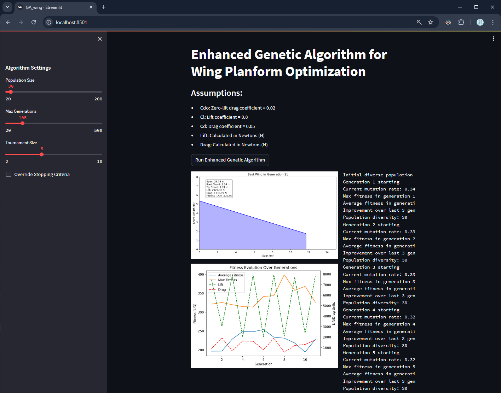

# Enhanced Genetic Algorithm for Wing Planform Optimization

This is a Python implementation of an enhanced genetic algorithm for optimizing the planform of an aircraft wing. The algorithm uses a population of wing designs, each represented as an individual, and evolves these designs over a number of generations to find the optimal configuration.

This work was originally published in 2010 by Rajesh Sampathkumar and Amit R Patel, and was converted to Python for this project. The current version includes a Streamlit UI, adaptive mutation rate, diversity preservation, elitism, tournament selection, fitness scaling, binary encoding, blend crossover, aspect ratio penalty, and visualization.



## Features

- **Streamlit UI**: Interactive interface for setting algorithm parameters and visualizing results. This UI allows for easy experimentation with different parameters and visualizations of the optimization process.
- **Adaptive Mutation Rate**: The mutation rate changes dynamically based on the current generation. This helps to prevent premature convergence and ensures that the population continues to evolve.
- **Diversity Preservation**: Techniques to maintain population diversity and prevent premature convergence. This is important to ensure that the population does not converge to a local optimum, but rather explores the solution space more thoroughly.
- **Elitism**: Preserves the best individuals across generations. This helps to ensure that the best solutions are not lost and that the population continues to evolve towards better solutions.   
- **Tournament Selection**: Improved selection process for choosing parents. This helps to ensure that the best individuals are selected for breeding, which helps to improve the population over time.
- **Fitness Scaling**: Linear scaling of fitness values to maintain selection pressure. This helps to ensure that the fittest individuals are selected for breeding, which helps to improve the population over time.
- **Binary Encoding**: Uses binary representation for more precise mutations and crossovers. This helps to ensure that the mutations and crossovers are more precise, which helps to improve the population over time.
- **Blend Crossover**: Implements a blend crossover method for creating offspring. This helps to ensure that the offspring are more similar to the parents, which helps to improve the population over time.
- **Aspect Ratio Penalty**: Penalizes wings with non-optimal aspect ratios. This helps to ensure that the wing designs are more efficient, which helps to improve the population over time.
- **Visualization**: Real-time plotting of the best wing design and fitness evolution. This helps to visualize the optimization process and to understand how the population evolves over time.

## Dependencies

The following Python libraries are required:
```
streamlit==1.25.0
dask==2023.10.0
matplotlib==3.8.0
numpy==1.25.2
```

These can be installed using the provided `requirements.txt` file.

## Usage

To run the enhanced genetic algorithm:

1. Ensure all dependencies are installed.
    ```
    pip install -r requirements.txt
    ```
2. Execute the `GA_wing.py` script. 
    ```
    streamlit run GA_wing.py
    ```
3. A Streamlit interface will open in your default web browser.
4. Adjust the algorithm settings in the sidebar:
   - Population Size
   - Max Generations
   - Tournament Size
   - Option to Override Stopping Criteria. The purpose of this is to allow the user to continue the optimization process even after the best result as per the initial stopping criteria has been found.
5. Click the "Run Enhanced Genetic Algorithm" button to start the optimization process.

## Algorithm Details

The enhanced genetic algorithm includes the following steps:

1. **Initialization**: Create a diverse initial population of wing designs. Currently set to 100 individuals.
2. **Evaluation**: Calculate fitness for each design, considering lift-to-drag ratio and diversity. Currently set to 100 generations.
3. **Selection**: Use tournament selection to choose parents for the next generation. Currently set to 20%.
4. **Crossover**: Combine parents using single-point crossover with binary encoding. Currently set to 50%.
5. **Mutation**: Apply adaptive mutation rate to introduce variations. Currently set to 10%.
6. **Elitism**: Preserve a percentage of the best individuals. Currently set to 10%.
7. **Diversity Maintenance**: Introduce random individuals if population diversity drops. Currently set to 10%.
8. **Termination**: Stop when improvement stagnates or max generations are reached. Currently set to 100 generations.

## Output

The algorithm provides:
- Real-time visualization of the best wing design in each generation.
- A plot showing the evolution of average fitness, max fitness, lift, and drag over generations.
- Final best wing configuration with its parameters and fitness score.

## Assumptions

The algorithm uses the following aerodynamic assumptions:
- Zero-lift drag coefficient (Cdo) = 0.02
- Lift coefficient (Cl) = 0.8
- Drag coefficient (Cd) = 0.05

## License

This code is open source and available for any purpose. Contributions and improvements are welcome.
